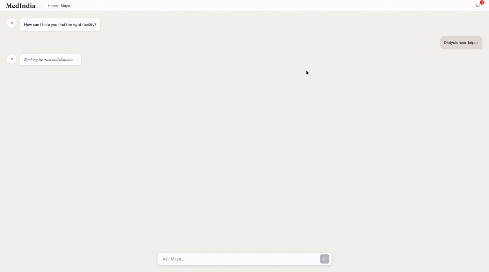

# MedIndia

Analyze messy health records and surface critical healthcare information to help coordinators make equitable data-backed decisions.

  
   
  
   

## Live app login

**https://meddesert-7474653569700804.aws.databricksapps.com**

Databricks Apps are always login-gated (they can't be made public), and Free Edition signs in
with a **one-time code emailed to the account**. We've set up a dedicated demo Google account so
you can retrieve that code:

- **Demo Gmail:** `databrickstest2026@gmail.com`
- **Gmail password:** `databricks2026`

### How to log in

1. Sign in to Gmail at https://mail.google.com with the demo account above — keep the tab open.
2. Open the app: **https://meddesert-7474653569700804.aws.databricksapps.com**
3. At the Databricks sign-in page, enter `databrickstest2026@gmail.com` and continue. A
   **6-character one-time code** is emailed to that inbox.
4. Switch back to the Gmail tab, open the new email from Databricks, and copy the code.
5. Paste it into the app and submit

## Stack

Next.js (App Router, TypeScript) UI + API routes, MapLibre GL choropleth, Databricks
Lakehouse, **Lakebase** for persistence. 
